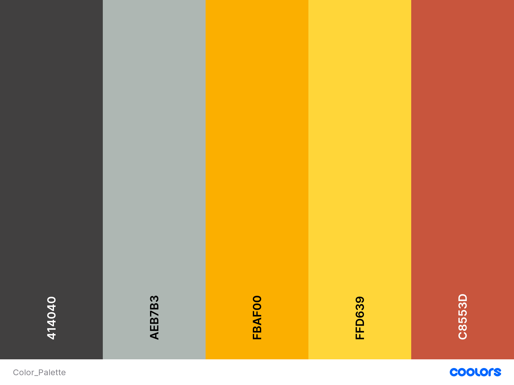

# Blog


Frontend application for showing blog with using firestore as database.

## Prerequisites
* npm

## Configuration
* Set web app's Firebase configuration

## Installing
```
npm install && npm run
```
Open the browser and hit
```
http://localhost:4200/
```
## Color palette
 

## Built with
* [TypeScript 4.0](https://www.typescriptlang.org/)
* [Angular 10.1](https://angular.io/)
* [Firestore](https://firebase.google.com/docs/firestore)
* [LessCss](http://lesscss.org/)
